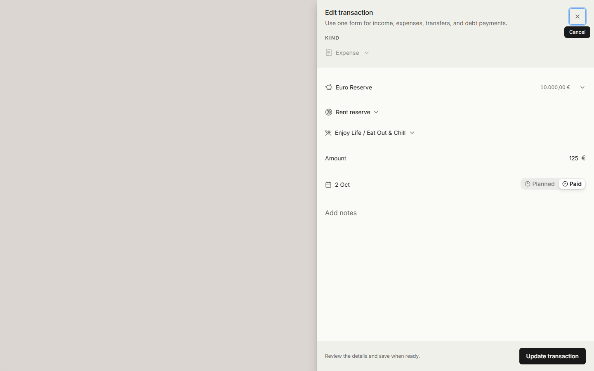

# Debt payments and recurring transaction invariants

Debt payments debit the source wallet by the entire payment. The destination debt or credit-card wallet receives only `principal_amount + extra_principal_amount`. Interest contributes to category expenses, never principal repayment. All three parts must be nonnegative and total the payment within the existing money precision. Interest-only payments are valid. The SQL trigger, optimistic ledger and projected balance use the same rule, including reversal on edit, delete and status changes.

`posted_destination_amount` records the effect actually applied to a paid debt transaction. Migration captures the preceding ledger contract without changing balances. Reversal uses that recorded effect, so deleting or changing a pre-fix payment reverses it exactly. Nonfinancial edits retain its effect; new or financially changed payments record principal plus extra principal. Clients cannot override the server stamp. Protected historical reconciliation rebases this metadata together with its balance correction, with the balance and stamping triggers disabled only for that metadata update.

Administrative balance corrections have immutable operation IDs in `finance_balance_reconciliations`, with before/after amounts and the reason. Authenticated users can read only their own receipts; application clients cannot write them. Corrections do not manufacture income/expense transactions, which would distort the historical ledger after rebasing its recorded effects.

Expenses from a savings goal use `source_allocation_id`. `allocation_id` (MCP `destination_allocation_id`) belongs to incoming income or transfers. Schedule templates, occurrences, local SQLite replicas, forms and goal history carry both directions. The migration moves existing expense links with the balance trigger disabled; it does not replay paid transactions or change wallet/goal balances.

## Materialization

`reconcile_recurring_schedule_internal` uses the existing SQL cadence generator over the current month through today plus 18 months. A deferred schedule-write trigger runs the same reconciler atomically on creation, edit and resume, including MCP writes. The schedule lock and unique slot index serialize concurrent materialization. Reconciliation updates only ordinary planned records; paid/skipped records and manual overrides retain their IDs, dates, amounts and mortgage splits. Pausing removes only ordinary planned records. Authenticated reconciliation is scoped by `auth.uid()`; internal helpers have no direct execute grants for public, anon or authenticated.

The authenticated application extends the horizon at login, reconnect and month changes in both online and local-first modes. Failures show one localized error per outage, with retries backing off from five minutes to one hour. Timer, visibility and reconnect events share that retry budget; success resets it. Local-first reconciliation first flushes queued commands. New server-created occurrences arrive through the existing PowerSync subscription.

## Occurrence identity and MCP errors

The selected transaction ID and original `schedule_occurrence_date` identify an occurrence. Ordinary edits, payment and skip cannot change that slot. A date outside its cadence period requires explicit rescheduling; the stored `is_explicit_reschedule` marker permits subsequent payment of that intentional move. Single-occurrence rescheduling preserves the slot; series rescheduling uses the dedicated RPC and moves affected planned slots in collision-safe order. The database period check protects all writers, including MCP.

MCP schedule patches reject unknown fields before merging with stored values. Validation rejects unsupported goal directions before any write, so adjacent valid fields cannot partially apply. Omission preserves a relationship; explicit `null` clears it. `values` must be an object, and JSON strings are never unpacked. Invalid transport JSON produces a parse error. Tool failures use MCP `isError` with readable localized content, while protocol errors keep JSON-RPC semantics.

## Release and verification

`20261002143541_debt_recurring_reliability.sql` changes schema and functions without replaying historical debt balances. Personal balance reconciliation is a separate protected, guarded operation after promotion, accounting for existing adjustments. Historical paid records stay unchanged. Bank-provided future mortgage splits must be applied as individual overrides; absent bank figures, preserve the current values.

Migration Preview rebuilds the complete history twice, seeds only synthetic `example.invalid` personas, checks existing RLS/grants, runs the rollback-only SQL suite in `supabase/tests/debt_recurring_reliability.sql`, and exercises concurrent authenticated reconciliation with `scripts/verify-recurring-concurrency.mjs`. The SQL suite covers principal-only effects and exact reversals, interest-only payments, credit-card MCP writes, source-goal debits, the horizon, retained overrides and explicit versus accidental period moves. Unit and MCP protocol tests cover the corresponding client/domain contracts. Production promotion requires successful migration and quality gates for the exact commit.

An additional isolated upgrade starts at the preceding migration, seeds paid legacy debt/goal rows, applies the actual new migration, and verifies unchanged balances, converted goal links, captured posted amounts and exact post-upgrade reversals. This checks data-bearing upgrades as well as clean rebuilds.

The focused Storybook state is `Organisms/TransactionFormSheet → Edit Expense From Source Goal`, using synthetic data. The global locale provider wraps application providers so localized reconciliation errors have context. Visual artifacts must contain only these fixtures.

